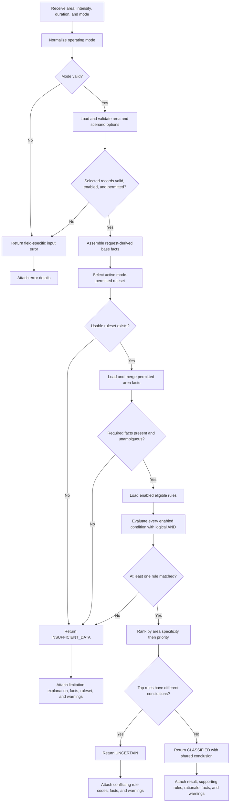

# FloodSense Day 3: Deterministic Rule-Based Expert System

**Official research title:**  
**FLOODSENSE: AN ANDROID-BASED EXPERT SYSTEM FOR FLOOD SUSCEPTIBILITY
ASSESSMENT AND PRE-EVENT PREPAREDNESS IN BACOOR CITY**

> **Current governance notice (17 September 2026):** This guide explains the
> inference implementation and historical developer demonstration workflow. It
> does not authorize an ordinary administrator to edit raw rules, rule
> conditions, or the inference algorithm. Follow
> `TA_CONSULTATION_SYSTEM_DECISIONS.md` and
> `ADMIN_WEB_7_DAY_IMPLEMENTATION_PLAN.md`; their current governance decisions
> supersede conflicting Admin instructions below.

## Day 3 outcome

Day 3 adds a database-driven inference service. It accepts a selected area and
two hypothetical rainfall scenario options, assembles facts, evaluates eligible
stored rules, and returns an explainable classification or limitation state.

The implementation does not contain scientific thresholds or a built-in rule
table. The four demonstration thresholds appear only in database-backed tests.
No demonstration rows, official classifications, APIs, DSS selection, Flutter
features, or GIS point-in-polygon assessment are added on Day 3.

### Current repository status after Day 4

Day 4 now calls this service through
`POST /api/v1/assessments/evaluate/` and passes a successful classification to
the separate DSS guidance service. The Day 3 inference rules and result
structure remain unchanged. The complete API and guidance workflow is
documented in `DAY_4_DSS_AND_API_GUIDE.md`.

## Minimal schema alignment

Migration `expert.0002_add_derived_scenario_facts` makes two focused changes:

1. `ScenarioOption.derived_value` stores the numeric fact represented by an
   option. Demonstration intensity options may store ranks 1–5 and duration
   options may store hours such as 1, 3, 6, 12, or 24. `display_order` remains
   presentation-only and is never treated as an inference fact.
2. `ExpertRuleCondition` gains `INTENSITY_RANK` and `DURATION_HOURS` condition
   types. Both use `expected_number` and one of the controlled numeric
   operators.

Derived-input conditions reject a scenario option, text expectation, or area-
fact key. Exact intensity-option and duration-option equality conditions remain
supported.

## Service entry point

Future views and APIs should call the service rather than reproduce inference
logic:

```python
from expert.services import evaluate_assessment

result = evaluate_assessment(
    area_identifier=area_id_or_code,
    intensity_code="DEMO_MODERATE",
    duration_code="DEMO_1_HOUR",
    mode="demonstration",
)
```

`area_identifier` accepts a database primary key or stable area code. Mode is
case-insensitive and must be `demonstration` or `official`. An unknown,
disabled, wrong-category, or mode-ineligible selected record raises
`AssessmentInputError`, a Django `ValidationError` subclass with field-specific
messages. Missing stored inference data produces an `INSUFFICIENT_DATA` result
instead of an exception or default classification.

## Methodology-ready Expert System algorithm

### Algorithm classification and accurate terminology

The current FloodSense inference algorithm is a **deterministic,
database-driven production-rule evaluation algorithm**. It is data-driven: the
engine starts with known facts and tests stored IF–THEN rule antecedents to
select a susceptibility conclusion. It does not use machine learning,
probability, fuzzy membership, unrestricted expressions, or generative AI.

The algorithm may be described as **forward rule matching** or a
**forward-chaining-style rule-based inference process** because evaluation
starts from facts and moves toward a conclusion. However, the current rules
produce terminal susceptibility levels rather than new intermediate facts.
Therefore, the current implementation performs one complete inference cycle;
it is not yet a general recursive or multi-hop forward-chaining engine in which
one fired rule creates facts that activate later rules. Chapter 3 and diagrams
should preserve this distinction unless the implementation is extended.

### Expert System components represented in the implementation

| Expert System concept | FloodSense implementation |
| --- | --- |
| Knowledge-acquisition interface | Django Admin forms for sources, facts, rulesets, rules, and conditions |
| Knowledge base | PostgreSQL records represented by `RuleSet`, `ExpertRule`, and `ExpertRuleCondition` |
| Working facts | Selected scenario values plus enabled, mode-permitted `AreaFact` records |
| Inference engine | `expert.services.evaluate_assessment()` |
| Conflict-resolution strategy | Geographic specificity, priority, then explicit tie handling |
| Explanation facility | Matched rule codes, stored rationales, facts used, ruleset version, and warnings |
| Knowledge governance | Source, publication status, operating mode, enabled flags, and ruleset version |

Django Admin manages the knowledge base; it does not itself calculate the
susceptibility result. PostgreSQL stores the knowledge; the inference service
interprets that knowledge.

### Algorithm inputs and outputs

Required inputs:

- `area_identifier`: local database ID or stable area code;
- `intensity_code`: controlled rainfall-intensity scenario code;
- `duration_code`: controlled rainfall-duration scenario code; and
- `mode`: `DEMONSTRATION` or `OFFICIAL`.

Primary outputs:

- `CLASSIFIED` with exactly one of `LOW`, `MODERATE`, `HIGH`, or `VERY_HIGH`;
- `UNCERTAIN` when equally ranked top rules have different conclusions; or
- `INSUFFICIENT_DATA` when the stored facts, ruleset, or rule coverage cannot
  support a conclusion.

Invalid user-selected identifiers are different from insufficient knowledge.
An unknown, disabled, wrong-category, or mode-ineligible selected record raises
a field-specific input error. Valid inputs with inadequate stored knowledge
return a limitation state rather than an exception.

### Exact inference process

1. Normalize and validate the requested operating mode.
2. Retrieve and validate the enabled geographic area.
3. In demonstration mode, require the area to be a neutral `DEMO_ZONE`.
4. Retrieve the intensity and duration options by code.
5. Confirm each option's category, enabled flag, status, and source eligibility.
6. Create the request-derived base facts: area code, intensity code/rank, and
   duration code/hours.
7. Retrieve the single active ruleset for the operating mode and confirm its
   publication/source eligibility.
8. If there is no usable ruleset, return `INSUFFICIENT_DATA`.
9. Retrieve enabled, mode-permitted area facts and merge them with base facts.
   Request-derived facts remain authoritative if an area fact uses the same
   key.
10. Confirm that `zone_baseline_rank`, `rainfall_intensity_rank`, and
    `rainfall_duration_hours` are present, numeric, and unambiguous.
11. If any required fact is missing or ambiguous, return
    `INSUFFICIENT_DATA`.
12. Retrieve enabled candidate rules from the active ruleset whose scope,
    source, status, and result level are eligible.
13. For every candidate rule, retrieve only its enabled conditions.
14. Reject a rule with zero enabled conditions so it cannot become an
    accidental unconditional match.
15. Evaluate every condition using a fixed operator lookup. Conditions within
    one rule use logical **AND**; the rule matches only if all are true.
16. If no eligible rule matches, return `INSUFFICIENT_DATA` without defaulting
    to Low.
17. Rank every matching rule first by area specificity and then by numeric
    priority.
18. Keep all rules tied at the highest rank.
19. If the top rules have different susceptibility conclusions, return
    `UNCERTAIN` and every conflicting rule code.
20. If all top rules have the same conclusion, return `CLASSIFIED`, that
    susceptibility level, and every supporting top-rule code.
21. Assemble the explanation from stored rationales, facts used, ruleset name
    and version, data status, and permanent warnings.

### Pseudocode matching the service

```text
FUNCTION EvaluateAssessment(area_identifier, intensity_code, duration_code, mode):
    normalized_mode = NormalizeAndValidateMode(mode)

    area = LoadAndValidateArea(area_identifier, normalized_mode)
    intensity = LoadAndValidateOption(intensity_code, INTENSITY, normalized_mode)
    duration = LoadAndValidateOption(duration_code, DURATION, normalized_mode)

    base_facts = {
        zone_code: area.code,
        rainfall_intensity_code: intensity.code,
        rainfall_intensity_rank: intensity.derived_value,
        rainfall_duration_code: duration.code,
        rainfall_duration_hours: duration.derived_value
    }

    ruleset = SelectUsableActiveRuleset(normalized_mode)
    IF ruleset does not exist:
        RETURN InsufficientData(base_facts, reason="No usable active ruleset")

    area_facts, conflicts = LoadPermittedAreaFacts(area, normalized_mode)
    facts = Merge(area_facts, base_facts, base_facts_take_precedence=True)

    IF required numeric facts are missing, nonnumeric, or conflicting:
        RETURN InsufficientData(facts, reason="Required facts unavailable")

    matching_rules = empty list
    FOR EACH rule IN LoadEligibleRules(ruleset, area, normalized_mode):
        conditions = EnabledConditions(rule)
        IF conditions is empty:
            CONTINUE
        IF EVERY condition satisfies Compare(facts, condition):
            ADD rule TO matching_rules

    IF matching_rules is empty:
        RETURN InsufficientData(facts, reason="No eligible rule matched")

    best_specificity = MaximumAreaSpecificity(matching_rules, area)
    specificity_winners = RulesAtSpecificity(matching_rules, best_specificity)
    best_priority = MaximumPriority(specificity_winners)
    top_rules = RulesAtPriority(specificity_winners, best_priority)

    IF CountDistinctConclusions(top_rules) > 1:
        RETURN Uncertain(facts, top_rules)

    RETURN Classified(facts, SharedConclusion(top_rules), top_rules)
END FUNCTION
```

### Fixed condition-comparison algorithm

The service maps each stored operator code to a fixed comparison function:

| Stored operator | Comparison |
| --- | --- |
| `EQ` | actual equals expected |
| `GT` | actual is greater than expected |
| `GTE` | actual is greater than or equal to expected |
| `LT` | actual is less than expected |
| `LTE` | actual is less than or equal to expected |

Exact scenario-option and text conditions accept only equality. Numeric area
facts, intensity rank, and duration hours accept all five controlled numeric
operators. Unsupported or malformed conditions evaluate as non-matches; the
engine never executes database text with `eval`.

### Conflict-resolution algorithm

The ranking tuple is conceptually:

```text
(geographic_specificity, priority)
```

`geographic_specificity` is `1` when a rule is scoped to the selected area and
`0` for a global rule. The greater tuple wins. Rule code is used only to keep
reported tied rules in deterministic order; it does not silently break a
conflict between different conclusions.

### Diagram-ready Expert System flow

The following Mermaid definition may be used as the technical starting point
for a Chapter 3 flowchart. Labels may be shortened for the final thesis figure,
but its decision branches should remain unchanged.



### Diagram decision-node reference

| Decision ID | Question | Yes branch | No branch |
| --- | --- | --- | --- |
| ES-D1 | Is the operating mode valid? | Validate stored inputs | Input error |
| ES-D2 | Are area and options valid, enabled, correctly categorized, and permitted? | Assemble facts | Input error |
| ES-D3 | Is exactly one usable active ruleset available? | Load area facts | `INSUFFICIENT_DATA` |
| ES-D4 | Are all required facts present and unambiguous? | Evaluate rules | `INSUFFICIENT_DATA` |
| ES-D5 | Does the rule have at least one enabled condition? | Evaluate conditions | Rule does not match |
| ES-D6 | Do all enabled conditions match? | Add matching rule | Rule does not match |
| ES-D7 | Did at least one eligible rule match? | Resolve precedence | `INSUFFICIENT_DATA` |
| ES-D8 | Do equally ranked top rules disagree? | `UNCERTAIN` | `CLASSIFIED` |

### Complexity and determinism

For `R` eligible rules and an average of `C` enabled conditions per rule, rule
matching is approximately `O(R × C)` after database retrieval. Fact assembly is
linear in the number of eligible area facts. The same stored records and same
inputs always produce the same result; no random value or model-generated text
participates in classification.

### Expert System review invariants

A future implementation or methodology diagram is consistent with the current
engine only when all of these remain true:

- Admin manages knowledge but does not itself calculate susceptibility.
- Every enabled condition within one rule is joined by logical AND.
- A rule with zero enabled conditions cannot match.
- Demonstration and official records never mix during one evaluation.
- Area-specific scope outranks global scope before numeric priority is compared.
- Equal top rank with different conclusions returns `UNCERTAIN`.
- No matching rule returns `INSUFFICIENT_DATA`, never a default Low result.
- Explanations are assembled from stored facts and rationales, not generated by
  an unrestricted language model.

### Chapter 3 implementation wording

A concise, implementation-faithful methodology statement is:

> FloodSense employed a deterministic, database-driven production-rule
> inference algorithm. User-selected rainfall scenarios and an administrator-
> maintained geographic baseline were converted into controlled facts. The
> engine evaluated all enabled and mode-permitted IF–THEN rules using logical
> AND, ranked complete matches by geographic specificity and explicit priority,
> and returned a classified, uncertain, or insufficient-data state. The result
> retained the matched rule identifiers, stored rationale, fact trace, ruleset
> version, data status, and safety warnings for explainability.

This paragraph documents the implemented software process. The thesis should
still cite appropriate academic sources for Expert Systems, production rules,
forward chaining, knowledge acquisition, and explanation facilities.

## Fact conversion

After validating the selected records, the service assembles these required
facts:

| Fact | Database source |
| --- | --- |
| `zone_code` | `GeographicArea.code` |
| `zone_baseline_rank` | Enabled numeric `AreaFact` with that key |
| `rainfall_intensity_code` | Selected intensity option code |
| `rainfall_intensity_rank` | Selected intensity option `derived_value` |
| `rainfall_duration_hours` | Selected duration option `derived_value` |

The result also includes `rainfall_duration_code` and every other enabled,
mode-permitted area fact. If the baseline fact is absent, nonnumeric, or
ambiguous, or either selected option lacks `derived_value`, evaluation returns
`INSUFFICIENT_DATA`.

An area fact cannot override a request-derived fact with the same key.
Demonstration evaluation uses only demonstration records backed by a
demonstration source. Official evaluation uses only approved records backed by
an approved, publicly releasable, non-demonstration source.

## Rule eligibility and condition evaluation

The service selects the one active, mode-permitted ruleset. No usable active
ruleset returns `INSUFFICIENT_DATA`. It then loads only enabled rules that:

- belong to that ruleset;
- are global or scoped to the selected area;
- have the required status and permitted source for the mode; and
- conclude with an enabled, mode-permitted susceptibility level.

A rule with no enabled conditions never matches. Otherwise, every enabled
condition must match. Disabled conditions are ignored.

| Condition type | Actual value | Supported operator |
| --- | --- | --- |
| `INTENSITY_OPTION` | Selected intensity option | `EQ` |
| `DURATION_OPTION` | Selected duration option | `EQ` |
| `AREA_FACT_TEXT` | Text area fact selected by `fact_key` | `EQ` |
| `AREA_FACT_NUMBER` | Numeric area fact selected by `fact_key` | `EQ`, `GT`, `GTE`, `LT`, `LTE` |
| `INTENSITY_RANK` | `rainfall_intensity_rank` | `EQ`, `GT`, `GTE`, `LT`, `LTE` |
| `DURATION_HOURS` | `rainfall_duration_hours` | `EQ`, `GT`, `GTE`, `LT`, `LTE` |

Operators are mapped to fixed Python comparison functions. The service never
uses `eval`, executes database content, or silently treats an unsupported or
malformed condition as true.

## Precedence, conflicts, and no-match behavior

All eligible matching rules are considered before a conclusion is selected:

1. An area-scoped rule outranks every global rule.
2. Within the same geographic specificity, the greater explicit `priority`
   wins.
3. If all equally ranked top rules have the same conclusion, the service
   returns `CLASSIFIED` and reports every supporting top rule code.
4. If equally ranked top rules have different conclusions, the service returns
   `UNCERTAIN` and reports every conflicting top rule code.
5. If no eligible rule matches, the service returns `INSUFFICIENT_DATA`.

The service never falls back to Low or any other default susceptibility level.

## Result structure

The service returns a serializable Python dictionary with this stable shape:

```text
assessment_state: CLASSIFIED | UNCERTAIN | INSUFFICIENT_DATA
susceptibility: null | {code, label, map_color}
area: {id, code, name}
scenario: {rainfall_intensity_code, rainfall_duration_code}
facts: {fact_name: value, ...}
matched_rule_codes: [rule_code, ...]
explanation:
  summary: human-readable matching or limitation explanation
  matched_rule_codes: [rule_code, ...]
  facts_used: ["fact=value", ...]
  rule_rationales: [stored rationale, ...]
  ruleset: "name vversion" | null
  warnings: [warning, ...]
ruleset: null | {name, version}
operating_mode: DEMONSTRATION | OFFICIAL
data_status: DEMONSTRATION | APPROVED
warnings: [warning, ...]
```

Every demonstration result includes:

- `DEMONSTRATION DATA—NOT OFFICIAL`
- `This result is not an official flood forecast, warning, or emergency instruction.`

The second warning also remains on official-mode results because even approved
susceptibility logic is not an official forecast or emergency instruction.

## Configure demonstration inference through Django Admin

Day 6 now provides the tested `seed_demo` command for an explicitly authorized
local development database. The manual steps below remain useful for learning
and Admin verification. Local database rows are not synchronized by Git; use
the Day 6 guide when the complete repeatable dataset is required.

### Step 1 — Apply migrations and create a local administrator

Run from the repository root:

```powershell
& ".\server\.venv\Scripts\python.exe" ".\server\manage.py" migrate
& ".\server\.venv\Scripts\python.exe" ".\server\manage.py" createsuperuser
```

The second command is needed only if the local administrator does not already
exist.

### Step 2 — Start Django and open Admin

```powershell
& ".\server\.venv\Scripts\python.exe" ".\server\manage.py" runserver 0.0.0.0:8000
```

Keep that terminal running, then open
`http://127.0.0.1:8000/admin/` and sign in.

### Step 3 — Create the demonstration source

Open **Provenance → Data sources** and create or verify one source with:

- Name: `DEMONSTRATION DATA—NOT OFFICIAL`
- Source type: `Demonstration/synthetic`
- Permitted use: `Fictional FloodSense development demonstration only.`
- Status: `Demonstration data—not official`
- Publicly releasable: leave unchecked for local development

Do not use a real agency source for these fictional values.

### Step 4 — Create and enable susceptibility levels

Open **Expert → Susceptibility levels** and create or verify:

| Code | Label | Display order | Example map color |
| --- | --- | ---: | --- |
| `LOW` | Low | 1 | `#4CAF50` |
| `MODERATE` | Moderate | 2 | `#F4C542` |
| `HIGH` | High | 3 | `#FF9800` |
| `VERY_HIGH` | Very High | 4 | `#D32F2F` |

For every level:

- use a definition that explicitly says it is a fictional demonstration
  classification;
- select the demonstration source;
- select demonstration status; and
- check **Is enabled**.

An otherwise valid rule is ignored when its resulting susceptibility level is
disabled. This was the cause of an earlier `INSUFFICIENT_DATA` result for the
Low rule.

### Step 5 — Create rainfall scenario options

Open **Expert → Scenario options**. The `derived_value`, not `display_order`, is
the numeric fact evaluated by the engine.

Create or verify these fictional intensity options:

| Category | Code | Label | Derived value | Display order |
| --- | --- | --- | ---: | ---: |
| Rainfall intensity | `DEMO_LIGHT` | Light | 1 | 1 |
| Rainfall intensity | `DEMO_MODERATE` | Moderate | 2 | 2 |
| Rainfall intensity | `DEMO_HEAVY` | Heavy | 3 | 3 |
| Rainfall intensity | `DEMO_INTENSE` | Intense | 4 | 4 |
| Rainfall intensity | `DEMO_TORRENTIAL` | Torrential | 5 | 5 |

Create or verify these fictional duration options:

| Category | Code | Label | Derived value | Unit | Display order |
| --- | --- | --- | ---: | --- | ---: |
| Rainfall duration | `DEMO_1_HOUR` | 1 hour | 1 | hours | 1 |
| Rainfall duration | `DEMO_3_HOURS` | 3 hours | 3 | hours | 2 |
| Rainfall duration | `DEMO_6_HOURS` | 6 hours | 6 | hours | 3 |
| Rainfall duration | `DEMO_12_HOURS` | 12 hours | 12 | hours | 4 |
| Rainfall duration | `DEMO_24_HOURS` | 24 hours | 24 | hours | 5 |

Select the demonstration source and status and check **Is enabled** for every
option. Leave minimum and maximum measurements blank unless a validated
methodology supplies them; these ranks and hours are scenario controls, not
official rainfall thresholds.

### Step 6 — Create a neutral demonstration area and baseline fact

Open **Geography → Geographic areas** and create or verify:

- Code: `DEMO_ZONE_A`
- Name: `Demo Zone A`
- Area type: `Demonstration zone`
- Geometry: draw a simple fictional polygon that does not represent a real
  barangay classification
- Source: the demonstration source
- Status: demonstration
- Is enabled: checked

Then open **Geography → Area facts** and create:

- Area: `Demo Zone A`
- Fact key: `zone_baseline_rank`
- Text value: blank
- Numeric value: `1`
- Source and status: demonstration
- Is enabled: checked

An area fact must contain exactly one value. Do not fill both text and numeric
value.

### Step 7 — Create and activate the ruleset

This is a historical, developer-only demonstration procedure. It is not an
ordinary administrator workflow in the custom portal.

Open **Expert → Rule sets** and create or verify:

- Name: `Demonstration Rules`
- Version: `1.0`
- Mode: `Demonstration`
- Source and status: demonstration
- Is active: checked
- Change summary: identify it as fictional development logic

Only one ruleset per mode can be active.

### Step 8 — Create the demonstration rules and conditions

This is a historical, developer-only demonstration procedure. Current
governance prohibits exposing these raw controls to ordinary administrators.

Open **Expert → Expert rules**. All rules use the active demonstration ruleset,
demonstration source/status, an empty geographic scope, and **Is enabled**.

| Rule | Result | Priority | Intensity rank | Duration hours | Baseline rank |
| --- | --- | ---: | ---: | ---: | ---: |
| `DEMO-RULE-100` | Low | 100 | ≥ 1 | ≥ 1 | ≥ 1 |
| `DEMO-RULE-200` | Moderate | 200 | ≥ 2 | ≥ 1 | ≥ 1 |
| `DEMO-RULE-300` | High | 300 | ≥ 3 | ≥ 3 | ≥ 2 |
| `DEMO-RULE-400` | Very High | 400 | ≥ 4 | ≥ 6 | ≥ 3 |

For each rule, add three enabled inline conditions:

1. **Rainfall intensity rank**, operator **Greater than or equal**, expected
   number from the table.
2. **Rainfall duration hours**, operator **Greater than or equal**, expected
   number from the table.
3. **Area numeric fact**, operator **Greater than or equal**, fact key
   `zone_baseline_rank`, and expected number from the table.

For derived intensity and duration conditions, leave scenario option, fact key,
and expected text blank. For the area numeric condition, leave scenario option
and expected text blank. Enter a clear stored rationale for every rule instead
of temporary text such as `Test`.

These values are fictional demonstration logic and must not be presented as a
scientific Bacoor classification.

## Run the Day 3 inference manually

### Step 1 — Use the Django shell

Run the shell from the repository root. Do not use a plain VS Code Python REPL,
because it does not automatically load the Django project or add `server` to
the Python import path.

```powershell
& ".\server\.venv\Scripts\python.exe" ".\server\manage.py" shell
```

At the `>>>` prompt:

```python
from pprint import pprint

from expert.services import evaluate_assessment

result = evaluate_assessment(
    area_identifier="DEMO_ZONE_A",
    intensity_code="DEMO_LIGHT",
    duration_code="DEMO_1_HOUR",
    mode="demonstration",
)

pprint(result)
```

Expected key values:

```text
assessment_state = CLASSIFIED
susceptibility.code = LOW
matched_rule_codes = [DEMO-RULE-100]
operating_mode = DEMONSTRATION
```

The permanent demonstration and non-authority warnings must also be present.

### Step 2 — Prove that Admin changes drive inference

To test without changing Python code:

1. In Admin, change Demo Zone A's `zone_baseline_rank` from `1` to `3`.
2. Use `DEMO_INTENSE` and `DEMO_6_HOURS` in the shell request.
3. Confirm that `DEMO-RULE-400` produces `VERY_HIGH`.
4. Restore the baseline to the intended local demonstration value after the
   test.

No Django restart is needed because every evaluation reads current database
records.

### Troubleshooting manual inference

- `ModuleNotFoundError: No module named 'expert'` means the command was run in a
  plain Python REPL. Exit it and use `manage.py shell` as shown above.
- `INSUFFICIENT_DATA` with no matched rules means no eligible rule matched, or a
  required record, fact, rule, condition, ruleset, or result level is disabled
  or mode-incompatible.
- A Low 1/1/1 scenario requires an enabled `DEMO-RULE-100`, all three enabled
  conditions, and an enabled Low susceptibility level.

## Prepare the local PostGIS test database

Django database tests normally create `test_floodsense`. A local application
role may be allowed to create databases but still cannot install the privileged
PostGIS extension. Prepare only the local test database once using the
PostgreSQL administrator, then reuse it.

First confirm that the configured Django database user is `floodsense` (or
replace that name in the later command):

```powershell
& ".\server\.venv\Scripts\python.exe" ".\server\manage.py" shell -c "from django.conf import settings; print(settings.DATABASES['default']['USER'])"
```

The following commands deliberately recreate only `test_floodsense`. Never run
them against the development, shared, staging, or deployed database:

```powershell
& "C:\Program Files\PostgreSQL\17\bin\psql.exe" `
    -h localhost -p 5432 -U postgres -d postgres -W `
    -c 'DROP DATABASE IF EXISTS test_floodsense WITH (FORCE);'

& "C:\Program Files\PostgreSQL\17\bin\psql.exe" `
    -h localhost -p 5432 -U postgres -d postgres -W `
    -c 'CREATE DATABASE test_floodsense OWNER floodsense;'

& "C:\Program Files\PostgreSQL\17\bin\psql.exe" `
    -h localhost -p 5432 -U postgres -d test_floodsense -W `
    -c 'CREATE EXTENSION IF NOT EXISTS postgis;'
```

Verify the extension:

```powershell
& "C:\Program Files\PostgreSQL\17\bin\psql.exe" `
    -h localhost -p 5432 -U postgres -d test_floodsense -W `
    -c 'SELECT PostGIS_Version();'
```

Run tests with `--reuse-db` so Django retains the administrator-prepared
extension:

```powershell
& ".\server\.venv\Scripts\python.exe" -m pytest -q --reuse-db
```

Do not put either PostgreSQL password in a command, source file, screenshot, or
Git commit.

## Automated coverage

The database-backed service tests create all records inside the test database.
They do not depend on local Admin rows, fixtures, or a `seed_demo` command. The
suite covers:

- Low, Moderate, High, and Very High demonstration results;
- no match and missing stored facts;
- invalid, disabled, wrong-category, and mode-ineligible selections;
- missing or unusable active rulesets;
- inactive rules, disabled conditions, and empty rules;
- geographic specificity, priority, conflicts, and same-result ties;
- strict demonstration/official separation;
- all five numeric comparison operators;
- exact scenario and text area-fact conditions;
- invalid derived-condition field combinations;
- explanation content and permanent warnings; and
- a changed stored area fact changing the result without Python changes.

Because these are real Django database tests, the configured PostgreSQL test
role must be able to create and remove the isolated `test_floodsense` database,
or the team must provide an equivalent dedicated test database configuration.
Do not point the test runner at a shared or deployed database.

## Verification commands

Run from the repository root:

```powershell
server\.venv\Scripts\python.exe -m ruff check server
server\.venv\Scripts\python.exe server\manage.py makemigrations --check --dry-run
server\.venv\Scripts\python.exe server\manage.py check
server\.venv\Scripts\python.exe -m pytest -q --reuse-db
server\.venv\Scripts\python.exe server\manage.py migrate --plan
```

`migrate --plan` is an inspection step. Do not apply project migrations to a
shared or deployed database unless the responsible team member explicitly
authorizes that target.

## What teammates run after pulling

No Python dependency changed. Each teammate should reuse their virtual
environment and prepare their own local `test_floodsense` database with PostGIS
before using `--reuse-db`, then run:

```powershell
server\.venv\Scripts\python.exe -m pip install -r server\requirements.txt
server\.venv\Scripts\python.exe server\manage.py migrate --plan
server\.venv\Scripts\python.exe server\manage.py migrate
server\.venv\Scripts\python.exe server\manage.py check
server\.venv\Scripts\python.exe -m pytest -q --reuse-db
```

Migrations and tests affect each teammate's local database environment; Git
does not synchronize local database rows or administrators. Day 3 does not add
any data import or seed command.

## Remaining Day 3 limitations

- Rules and demonstration records can now be prepared by the reviewed Day 6
  `seed_demo` command or inspected and edited manually in Django Admin.
- Day 4 now exposes the assessment service through the API and selects separate
  DSS guidance for classified results.
- Flutter and the dynamic map do not yet consume results.
- Area selection uses an identifier; coordinate point-in-polygon resolution is
  deferred.
- DSS guidance is currently selected by susceptibility level; validated
  scenario-specific guidance filters are deferred.
- All demonstration ranks and test rules remain fictional and scientifically
  unvalidated.
