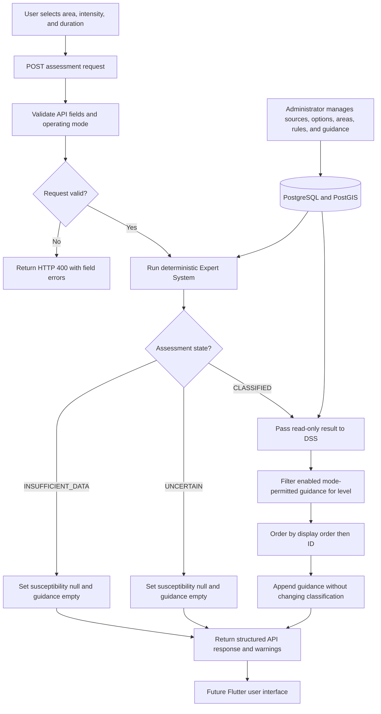
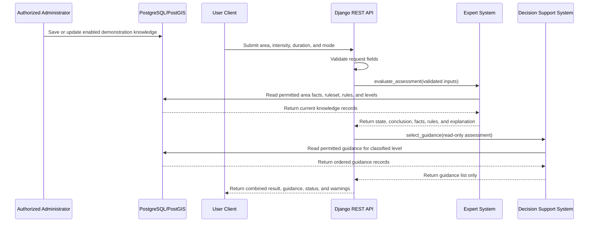

# FloodSense Day 4: DSS and Admin-to-User API Guide

**Official research title:**  
**FLOODSENSE: AN ANDROID-BASED EXPERT SYSTEM FOR FLOOD SUSCEPTIBILITY
ASSESSMENT AND PRE-EVENT PREPAREDNESS IN BACOOR CITY**

## Day 4 outcome

Day 4 connects the existing database-managed demonstration content to a
versioned REST API. The API exposes eligible rainfall choices and geographic
polygons, evaluates a scenario through the Day 3 Expert System, and appends
preparedness guidance selected by a separate DSS service.

The Expert System remains the only component that determines susceptibility.
The DSS reads a completed `CLASSIFIED` assessment and never changes its level,
facts, matched rules, or explanation. `UNCERTAIN` and `INSUFFICIENT_DATA`
responses always contain an empty guidance list.

Day 4 does not add Flutter screens, point-in-polygon assessment, persistent
assessment history, evacuation routing, official content, or a `seed_demo`
command.

## Shared publication policy

The Expert System, DSS, scenario-options endpoint, and geography endpoint use
one operating-mode policy:

- demonstration mode accepts only `DEMONSTRATION` records backed by a
  demonstration source;
- official mode accepts only `APPROVED` records backed by an approved,
  publicly releasable, non-demonstration source;
- disabled, pending, restricted, retired, and mode-incompatible records are
  excluded; and
- demonstration geography endpoints and assessments accept only neutral
  `DEMO_ZONE` records.

Every demonstration response includes:

- `DEMONSTRATION DATA—NOT OFFICIAL`
- `This result is not an official flood forecast, warning, or emergency instruction.`

The second warning also remains in official-mode responses because FloodSense
does not replace instructions from authorized agencies.

## Methodology-ready DSS and integration algorithms

### Algorithm classification and system boundary

The current Decision Support System uses a **deterministic,
classification-driven guidance filtering and ordering algorithm**. It is a
knowledge-based retrieval component: it receives a completed Expert System
result, selects compatible preparedness records from PostgreSQL, and returns
them in administrator-defined order.

The DSS does not recalculate, raise, lower, or otherwise modify susceptibility.
It does not forecast a flood, optimize an evacuation route, issue an official
warning, or use machine learning. Rainfall intensity and duration are carried
in the completed assessment context, but the current reviewed `GuidanceItem`
schema selects guidance only by susceptibility level, mode, source/status, and
enabled state.

The separation for methodology and diagrams is:

```text
Expert System: facts + rules -> susceptibility conclusion
DSS: susceptibility conclusion -> preparedness guidance
API: validates inputs and combines both outputs for the user
```

There must be no arrow from the DSS back to the Expert System conclusion. The
DSS output is guidance only.

### DSS components represented in the implementation

| DSS concept | FloodSense implementation |
| --- | --- |
| Decision input | Read-only completed Expert System assessment |
| Decision criterion | Classified susceptibility code and operating mode |
| Guidance knowledge base | `GuidanceItem` rows linked to `SusceptibilityLevel` |
| Eligibility policy | Enabled flag plus record/source status permitted for the mode |
| Selection service | `dss.services.select_guidance()` |
| Stable presentation order | `display_order`, followed by database ID |
| Output | Zero or more preparedness-guidance objects |
| Safety constraint | Guidance cannot modify or replace the susceptibility result |

### Exact DSS selection process

1. Receive the completed assessment dictionary as read-only input.
2. Keep a snapshot used to verify that guidance selection did not mutate the
   assessment.
3. Check `assessment_state`.
4. If the state is not `CLASSIFIED`, return an empty guidance list.
5. Read the susceptibility code, operating mode, intensity code, and duration
   code from the assessment.
6. If that required classification/scenario context is incomplete, return an
   empty guidance list.
7. Normalize the operating mode.
8. Retrieve the susceptibility level by controlled code and require it to be
   enabled and mode-permitted.
9. If the level is unavailable, return no guidance to the assessment API. The
   direct guidance endpoint instead reports a field-specific HTTP 400 response.
10. Retrieve `GuidanceItem` records linked to that exact level.
11. Keep only enabled items whose record status and source are permitted in the
    operating mode.
12. Sort the eligible records by ascending `display_order`, then ascending ID
    for stable tie handling.
13. Serialize each item with its ID, title, instruction, category, order, data
    status, and source summary.
14. Verify that the original assessment has not changed.
15. Return the guidance list separately from the Expert System result.

### DSS pseudocode

```text
FUNCTION SelectGuidance(assessment):
    original_assessment = Copy(assessment)

    IF assessment.state is not CLASSIFIED:
        RETURN empty list

    level_code = assessment.susceptibility.code
    mode = assessment.operating_mode
    intensity_code = assessment.scenario.rainfall_intensity_code
    duration_code = assessment.scenario.rainfall_duration_code

    IF level_code, mode, intensity_code, or duration_code is missing:
        RETURN empty list

    level = LoadEnabledPermittedLevel(level_code, mode)
    IF level does not exist:
        RETURN empty list

    guidance = LoadGuidanceItems(
        susceptibility_level=level,
        enabled=True,
        permitted_for_mode=mode
    )
    guidance = Sort(guidance, display_order ASC, id ASC)
    output = Serialize(guidance)

    ASSERT assessment equals original_assessment
    RETURN output
END FUNCTION
```

### Shared data-eligibility algorithm

The same policy is reused by the Expert System and public API selectors:

```text
FUNCTION RecordIsPermitted(record, mode):
    IF mode is DEMONSTRATION:
        RETURN record.status is DEMONSTRATION
           AND source.status is DEMONSTRATION
           AND source.type is DEMONSTRATION

    IF mode is OFFICIAL:
        RETURN record.status is APPROVED
           AND source.status is APPROVED
           AND source.type is not DEMONSTRATION
           AND source.is_publicly_releasable is TRUE

    RETURN FALSE
END FUNCTION
```

This policy prevents pending, restricted, retired, disabled, or
mode-incompatible material from silently reaching a user response.

### Assessment API orchestration process

1. The client submits mode, geographic area ID, intensity code, and duration
   code to `POST /api/v1/assessments/evaluate/`.
2. The Django REST Framework serializer validates required fields, types, and
   basic formatting.
3. The API calls `expert.services.evaluate_assessment()`; it does not duplicate
   the inference algorithm inside the view.
4. Invalid selected records are translated into field-specific HTTP 400
   responses.
5. A valid request produces `CLASSIFIED`, `UNCERTAIN`, or
   `INSUFFICIENT_DATA`.
6. The API passes the complete result to `dss.services.select_guidance()`.
7. The DSS returns guidance only for a classified, eligible result; otherwise,
   it returns an empty list.
8. The API creates one response containing the unchanged Expert System result
   plus a separate `guidance` array.
9. The request is not saved as assessment history and does not persist a user's
   precise location.

### Diagram-ready end-to-end flow



### Diagram-ready interaction sequence



### Diagram decision-node reference

| Decision ID | Question | Yes or matching branch | Other branch |
| --- | --- | --- | --- |
| API-D1 | Is the request structurally valid? | Call Expert System | HTTP 400 |
| API-D2 | Are selected records valid and mode-permitted? | Continue inference | HTTP 400 |
| DSS-D1 | Is the assessment `CLASSIFIED`? | Read classification context | Return `guidance=[]` |
| DSS-D2 | Is the classification/scenario context complete? | Load level | Return `guidance=[]` |
| DSS-D3 | Is the susceptibility level enabled and permitted? | Query guidance | Return `guidance=[]` or direct-endpoint HTTP 400 |
| DSS-D4 | Is each guidance item enabled and permitted? | Include item | Exclude item |

### Data lineage and traceability

| Response information | Origin |
| --- | --- |
| Area ID, code, name, and geometry | `GeographicArea` managed in Admin |
| Scenario codes and numeric values | `ScenarioOption` managed in Admin |
| Classification facts | Scenario options plus `AreaFact` |
| Susceptibility conclusion | Highest-ranked nonconflicting `ExpertRule` match |
| Explanation and rule codes | Inference trace plus stored rule rationale |
| Guidance title and instruction | `GuidanceItem` selected by the DSS |
| Data status and warnings | Shared operating-mode/publication policy |

This lineage is why an authorized Admin change appears on the next request:
the services query the current database records instead of embedding permanent
rules or guidance in Flutter or Python source code.

### Complexity and determinism

For `G` eligible guidance rows, filtering and serialization are linear in `G`.
Ordering is typically `O(G log G)` and is performed deterministically by the
database using `display_order, id`. Given the same assessment and stored
guidance records, the DSS always returns the same ordered list.

### DSS and integration review invariants

A future implementation or methodology diagram is consistent with Day 4 only
when all of these remain true:

- The client communicates with Django API endpoints, never directly with
  PostgreSQL/PostGIS.
- Admin writes records through Django validation; it does not send a result
  directly to the user.
- The Expert System produces the susceptibility conclusion before the DSS is
  called.
- The DSS receives the assessment as read-only input and returns guidance only.
- `UNCERTAIN` and `INSUFFICIENT_DATA` responses contain no class-dependent
  guidance.
- Disabling guidance can change the guidance list but cannot change the
  susceptibility level or matched rule.
- Every public record passes the shared operating-mode, status, source, and
  enabled-state policy.
- An Admin edit becomes visible on the next request because the API reads the
  database each time; Flutter must not contain permanent copies of rules or
  guidance.

### Chapter 3 implementation wording

A concise, implementation-faithful methodology statement is:

> After the rule-based Expert System produced a classified susceptibility
> result, FloodSense applied a deterministic Decision Support System selection
> process. The DSS treated the assessment as read-only input, retrieved enabled
> preparedness guidance linked to the resulting susceptibility level, enforced
> operating-mode and publication-source eligibility, and ordered the applicable
> items using administrator-defined display order. The API returned the
> unchanged susceptibility conclusion together with the separate guidance,
> explanation, provenance status, and safety warnings.

This document describes the implemented software algorithm. Chapter 3 should
add appropriate academic references for Decision Support Systems, knowledge-
based systems, software architecture, and evaluation methodology.

## DSS selection flow

`dss.services.select_guidance()` receives the completed Expert System result.
That object already contains the susceptibility level, selected rainfall
intensity, selected duration, and operating mode.

The current `GuidanceItem` container is intentionally level-based. The DSS:

1. returns nothing unless the assessment state is `CLASSIFIED`;
2. confirms that the susceptibility level is enabled and permitted for the
   assessment mode;
3. retrieves only enabled and mode-permitted guidance for that level;
4. sorts items by administrator-managed `display_order`, then database ID; and
5. returns the title, instruction, category, status, and source summary without
   mutating the assessment.

Rainfall intensity and duration remain present in the assessment passed to the
DSS. Context-specific guidance conditions are deferred because the current
reviewed `GuidanceItem` model has no validated scenario-filter fields.

## API endpoints

All endpoints are under `/api/v1/`. They are public for the first demonstration
vertical slice, but they expose only records permitted by the operating-mode
policy. Django Admin remains authenticated.

### Assessment choices

```text
GET /api/v1/assessment-options/?mode=demonstration
```

Returns enabled intensity and duration options in administrator-defined display
order, plus data status and warnings.

### Geographic areas and polygons

```text
GET /api/v1/geography/areas/?mode=demonstration
```

Returns a GeoJSON `FeatureCollection`. Each permitted feature contains its ID,
code, name, area type, status, update timestamp, source summary, and
`MultiPolygon` geometry. Day 4 lists stored polygons; coordinate-based
point-in-polygon resolution remains Day 6 work.

### Evaluate an assessment and obtain DSS guidance

```text
POST /api/v1/assessments/evaluate/
Content-Type: application/json
```

Example request:

```json
{
  "mode": "demonstration",
  "geographic_area_id": 1,
  "rainfall_intensity_code": "DEMO_LIGHT",
  "rainfall_duration_code": "DEMO_1_HOUR"
}
```

The response retains the complete Day 3 result structure and adds:

```json
{
  "guidance": [
    {
      "id": 1,
      "title": "Review basic preparedness supplies",
      "instruction": "Review household supplies and continue monitoring official information.",
      "category": "PREPARE",
      "display_order": 10,
      "data_status": "DEMONSTRATION",
      "source": {
        "id": 1,
        "name": "DEMONSTRATION DATA—NOT OFFICIAL",
        "organization": ""
      }
    }
  ]
}
```

Unknown, disabled, wrong-category, mode-incompatible, or non-demonstration-zone
inputs produce an HTTP 400 response with field-specific details. A valid
request with missing rule coverage remains HTTP 200 with
`assessment_state=INSUFFICIENT_DATA`, `susceptibility=null`, and `guidance=[]`.

### Retrieve guidance for a known level

```text
GET /api/v1/dss/guidance/?mode=demonstration&susceptibility_level=LOW
```

This endpoint supports clients that already hold a valid classification. The
integrated assessment endpoint remains the preferred way to obtain an Expert
System result and its applicable guidance together.

## Enter provisional guidance through Django Admin

No guidance rows are installed automatically. Local Admin records remain local
database content and are not synchronized by Git.

1. From the repository root, start Django:

   ```powershell
   & ".\server\.venv\Scripts\python.exe" ".\server\manage.py" runserver 0.0.0.0:8000
   ```

2. Keep that terminal running and open
   `http://127.0.0.1:8000/admin/` in a browser.
3. Sign in with a local staff or superuser account.
4. Open **DSS → Guidance items** and choose **Add guidance item**.
5. Select an enabled demonstration susceptibility level. For the 1/1/1 test,
   select **Low**.
6. Enter a clearly provisional title such as
   `Review basic preparedness supplies`.
7. Enter an instruction such as
   `Review household supplies and continue monitoring official information.`
8. Select **Prepare** as the category and enter `10` as display order.
9. Select the same demonstration source used by the susceptibility level and
   rules.
10. Set status to **Demonstration data—not official**.
11. Check **Is enabled** and save.

Safe provisional intent examples are:

| Level | Example intent requiring later validation |
| --- | --- |
| Low | Maintain basic readiness and monitor official information. |
| Moderate | Review supplies, household plans, and vulnerable members' needs. |
| High | Prepare essential items and documents and monitor official instructions closely. |
| Very High | Be ready to act promptly and follow instructions issued by authorized authorities. |

Do not word a demonstration record as an evacuation order or official warning.

## Complete manual Day 4 test

These steps reproduce the verified Admin-to-database-to-API flow. Keep Django
running in the first terminal and open a second PowerShell terminal at the
repository root.

### Step 1 — Check the rainfall options endpoint

```powershell
$options = Invoke-RestMethod `
    -Method Get `
    -Uri "http://127.0.0.1:8000/api/v1/assessment-options/?mode=demonstration"

$options | ConvertTo-Json -Depth 10
```

Confirm that `DEMO_LIGHT` appears under `intensity_options`, `DEMO_1_HOUR`
appears under `duration_options`, and the demonstration warnings are present.

### Step 2 — Retrieve GeoJSON and find the real local area ID

Do not assume that Demo Zone A has ID `1`; obtain it from the current local
database:

```powershell
$areas = Invoke-RestMethod `
    -Method Get `
    -Uri "http://127.0.0.1:8000/api/v1/geography/areas/?mode=demonstration"

$areas.features.properties |
    Format-Table id, code, name, area_type

$areaId = (
    $areas.features |
    Where-Object { $_.properties.code -eq "DEMO_ZONE_A" }
).properties.id

Write-Host "Demo Zone A ID: $areaId"
```

The endpoint must return a GeoJSON `FeatureCollection`, and Demo Zone A must
have `area_type=DEMO_ZONE`.

### Step 3 — Build the assessment request

```powershell
$body = @{
    mode = "demonstration"
    geographic_area_id = $areaId
    rainfall_intensity_code = "DEMO_LIGHT"
    rainfall_duration_code = "DEMO_1_HOUR"
} | ConvertTo-Json

$body
```

### Step 4 — Submit the assessment

Creating `$body` does not send the request. Assign the response to `$result`:

```powershell
$result = Invoke-RestMethod -Method Post -Uri "http://127.0.0.1:8000/api/v1/assessments/evaluate/" -ContentType "application/json" -Body $body
```

Use the single-line form above if multiline PowerShell continuation characters
are confusing.

### Step 5 — Inspect the result explicitly

```powershell
$result | ConvertTo-Json -Depth 20

Write-Host "Assessment state: $($result.assessment_state)"
Write-Host "Susceptibility: $($result.susceptibility.code)"
Write-Host "Matched rule: $($result.matched_rule_codes)"
Write-Host "Guidance count: $(@($result.guidance).Count)"
$result.guidance | Select-Object title, instruction
$result.warnings
```

With the enabled Low rule and Low guidance, expect:

```text
Assessment state: CLASSIFIED
Susceptibility: LOW
Matched rule: DEMO-RULE-100
Guidance count: 1
```

The exact guidance count can be greater than one if multiple eligible Low
items were entered. Every returned item must be enabled, demonstration-status,
and linked to the Low level.

### Step 6 — Test the direct DSS endpoint

Use a browser or `Invoke-RestMethod`:

```powershell
$guidanceResult = Invoke-RestMethod `
    -Method Get `
    -Uri "http://127.0.0.1:8000/api/v1/dss/guidance/?mode=demonstration&susceptibility_level=LOW"

$guidanceResult | ConvertTo-Json -Depth 10
```

Do not paste a bare URL directly at the PowerShell prompt. PowerShell attempts
to execute it as a command and reports that the URL is not recognized.

### Step 7 — Prove that an Admin edit reaches the next API response

1. edit the returned guidance item in Django Admin;
2. change its instruction to `This text was changed through Django Admin.`;
3. save the record;
4. submit the same assessment again:

   ```powershell
   $result = Invoke-RestMethod -Method Post -Uri "http://127.0.0.1:8000/api/v1/assessments/evaluate/" -ContentType "application/json" -Body $body
   $result.guidance | Select-Object title, instruction
   ```

5. confirm that the changed instruction appears immediately.

No server restart is required because each request reads current database
records. The automated suite performs this same integration check by posting an
edit through Django Admin and requesting a new assessment.

### Step 8 — Prove that disabling guidance does not change susceptibility

1. In Admin, uncheck **Is enabled** on the Low guidance item and save it.
2. Submit the same assessment request again.
3. Check the result with explicit output:

   ```powershell
   $result = Invoke-RestMethod -Method Post -Uri "http://127.0.0.1:8000/api/v1/assessments/evaluate/" -ContentType "application/json" -Body $body

   Write-Host "Assessment state: $($result.assessment_state)"
   Write-Host "Susceptibility: $($result.susceptibility.code)"
   Write-Host "Matched rule: $($result.matched_rule_codes)"
   Write-Host "Guidance count: $(@($result.guidance).Count)"
   $result | ConvertTo-Json -Depth 20
   ```

Expected:

```text
Assessment state: CLASSIFIED
Susceptibility: LOW
Matched rule: DEMO-RULE-100
Guidance count: 0
```

The complete JSON must contain `"guidance": []`. A pipeline such as
`$result.guidance | Select-Object title, instruction` displays no rows for an
empty array; that blank table output is correct and is not an error.

Re-enable the guidance item after this test and submit the request again. Its
guidance count should return to `1` (or the number of other eligible Low items).
Press `Ctrl+C` in the Django terminal when manual API testing is complete.

### Step 9 — Interpret common results

- HTTP 400 with `area_identifier` means the selected area is missing,
  disabled, mode-incompatible, or not a neutral demonstration zone.
- HTTP 400 with `intensity_code` or `duration_code` means the selected option
  is unknown, disabled, has the wrong category, or is mode-incompatible.
- HTTP 200 with `INSUFFICIENT_DATA` means the request was valid but no eligible
  stored rule produced a conclusion, or a required fact/ruleset/result level is
  unavailable.
- `CLASSIFIED` with `guidance=[]` means inference succeeded but no enabled,
  mode-permitted guidance exists for that result.

## Verification

### Prepare PostGIS for database-backed tests

If pytest reports `permission denied to create database`, the configured local
database role lacks `CREATEDB`. If the next run reports
`permission denied to create extension "postgis"`, database creation succeeded
but the non-administrative role cannot install PostGIS. These are PostgreSQL
test-environment permissions, not failed FloodSense assertions.

Follow the **Prepare the local PostGIS test database** section in the Day 3
guide. It recreates only `test_floodsense`, installs PostGIS as the local
`postgres` administrator, and then uses `--reuse-db`.

### Run all checks

From the repository root:

```powershell
& ".\server\.venv\Scripts\python.exe" -m ruff check server
& ".\server\.venv\Scripts\python.exe" ".\server\manage.py" makemigrations --check --dry-run
& ".\server\.venv\Scripts\python.exe" ".\server\manage.py" check
& ".\server\.venv\Scripts\python.exe" -m pytest -q --reuse-db
& ".\server\.venv\Scripts\python.exe" ".\server\manage.py" migrate --plan
```

The verified Day 4 result is `54 passed`. The warnings about the missing local
`server/staticfiles` output directory and dependency metadata do not fail the
suite.

Day 4 changes no model and creates no migration. Tests create fictional neutral
records inside an isolated test database; they do not depend on local Admin
rows, fixtures, or a seed command.

## What teammates run after pulling

No dependency or migration changed. Teammates should first prepare their own
local `test_floodsense` database with PostGIS as documented in the Day 3 guide,
then verify their local environment:

```powershell
server\.venv\Scripts\python.exe -m pip install -r server\requirements.txt
server\.venv\Scripts\python.exe server\manage.py migrate --plan
server\.venv\Scripts\python.exe server\manage.py migrate
server\.venv\Scripts\python.exe server\manage.py check
server\.venv\Scripts\python.exe -m pytest -q --reuse-db
```

Each teammate must create their own local demonstration rows through Admin
until a separate, reviewed, idempotent demonstration-data command is actually
implemented.
